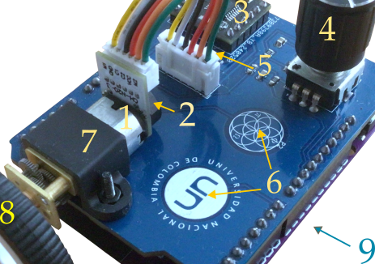

# DCMotor

## Laboratorio portátil de control de ángulo y velocidad angular en un servomotor.

Este paquete de Julia permite hacer experimentos de control e identificación con la plataforma portátil de experimentación **DCMotor**. Esta plataforma integra los componentes para controlar un servomotor DC por medio de un microcontrolador ESP32.

  

Desde una perspectiva de control y sistemas dinámicos, la plataforma permite representar vívidamente varios conceptos, a saber:

- Representa la respuesta de sistemas de primer orden estable cuando se controla la velocidad angular.
- Representa la respuesta de sistema de segundo orden  inestable con un integrador cuando se controla él ángulo.
- El motor DC es un ejemplo clásico de sistema multidominio, pues incluye elementos del dominio eléctrico y mecánico.

Adicionalmente, las constantes de tiempo están muy sintonizadas con la percepción humana. Esto convierte al motor DC en un sistema muy ilustrativo y pedagógico.

## Instalación

Las instrucciones de instalación del paquete, sus funciones y la instalación del *firmmare* de la plataforma se encuentran en la
[documentación](https://nebisman.github.io/DCMotor.jl). 

