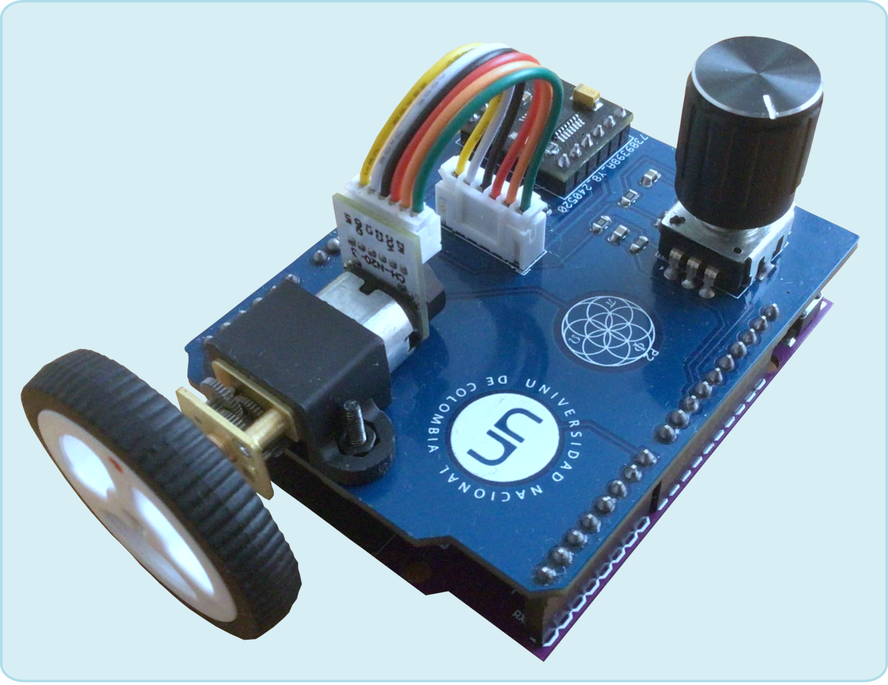

```@meta
CurrentModule = DCMotor
```

# DCMotor.jl

Laboratorio portátil de control de ángulo y velocidad angular de un servomotor.


Este paquete de Julia permite hacer experimentos de control e identificación con la
plataforma  de experimentación portátil llamada **DCMotor**. Esta plataforma integra los
componentes para controlar un servomotor DC por medio de un microcontrolador ESP32.


```@raw html
<p align="center">
  
</p>
```


Para instalar el paquete y el firmware asociado, vea la sección [Instalación del
paquete](@ref). Para el listado completo de funciones, ver el
panel izquierdo, en la sección **Funciones** (Información, Identificación y
Control).

## Introducción rápida

Instaler el paquete directamente desde este repositorio, así:

```julia
using Pkg
Pkg.add(url="https://github.com/nebisman/DCMotor.jl")
```

Luego, para empezar a usarlo, ejecute el siguiente código:

```julia
using DCMotor
sys = MotorSystem();
set_reference(sys,360)
```
El sistema debe reaccionar y mostrar el cambio a una referencia de $$360^o$$ en ángulo.
